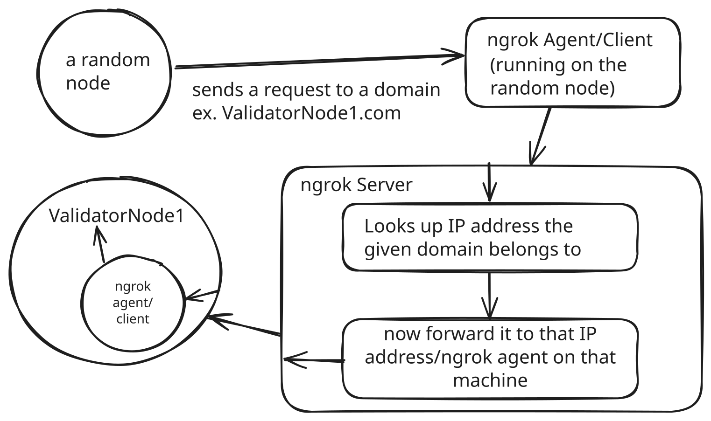

# ngrok

## Overview:

To summarize in a single sentence, ngrok basically allows you to connect to a locally running application (think localhost) over the internet via an agent/client or an instance of the ngrok docker image running on your machine. 

So why are we using ngrok? The addresses of Ethereum validator nodes in a peer-to-peer network using PoA (proof of authority) need to be specified in our genesis.json file, which is the file from which the very first block of our blockchain is created. Basically, we have to know how to reach the validator nodes before we even start any of the nodes on our network. 

Usually, to give every node this contact information, we need to define the IP addresses of the validator nodes in genesis.json. Now when you are a student that's frequently between school, home and other places, your public IP address will almost never be the same. It will be assigned by the current internet you are using. So how do we account for the changes in IP addresses?

This is where ngrok comes in. ngrok has servers all around the world. It sets up a static domain (think validator1.com) that forwards connections to the computer for which the static domain belongs to. This allows us to bypass the changes in IP addresses and always refer to this static domain whenever we want to connect to a certain machine, which is useful when our IP addresses are changing constantly. 

So when we set up ngrok on our machine and configure it to listen to several ports, including the P2P port, the http port and some others, we allow connections from the outside world to our machine by using the static domain. 

Now what this means for our network is that we can define several static domains as the addresses to which any machine can contact the validator nodes in our genesis.json file without using any IP addresses. And wherever the machines that are validators go, they'll still be contacted by others. 

ngrok still relies on IP addresses under the hood, but the agent/client or instance of ngrok tells the ngrok server what the IP address of the machine is. 

The following diagram gives a high level overview of how the static domain maps to a machine:



The only dillemma we face is that we are using the free tier of ngrok, which does not allow you to predefine your static domain. Instead, every time you start ngrok on a validator node's machine (or any other machine on the network), ngrok itself generates the domain. This means that if we want our validator nodes to be persistent, we have to start the ngrok client or instance and keep it running constantly in the background. The only alternative to this would be to purchase the paid tier (not happening). 

So every time we want to start our nodes, we have to start ngrok on all validator nodes ahead of time and put their domains in our genesis.json file, which is the current configuration we are going to use. The instructions below give a short demo on how to do just that.

## Setup Steps for Validator Nodes (Current instructions for MacOS/Linux)

1. Create an ngrok account, add a credit card to it (required for free tier, your card won't be charged)

2. Install ngrok on your machine\
```command-line//
 brew install ngrok
```
3. Add your auth token to your ngrok 
```command-line//
ngrok config add-authtoken <your-auth-token-here>
```

4. Start ngrok on your machine, configured to listen in on the P2P port 30303
```command-line//
ngrok tcp 30303
```

Your output should look something like this:
```command-line//
ngrok                                                           (Ctrl+C to quit)
                                                                                
🔀 Route traffic by anything: https://ngrok.com/r/iep                           
                                                                                
Session Status                online                                            
Account                       awais (Plan: Free)                                
Version                       3.22.0                                            
Region                        United States (us)                                
Latency                       46ms                                              
Web Interface                 http://127.0.0.1:4040                             
Forwarding                    tcp://4.tcp.ngrok.io:14852 -> localhost:30303     
                                                                                
Connections                   ttl     opn     rt1     rt5     p50     p90       
                              0       0       0.00    0.00    0.00    0.00   
```
Notice in the **Forwarding** section, there is a domain name, in this case `tcp://4.tcp.nrok.io:14852`. This is the public facing address (static domain) that other nodes will use to connect to this valdiator node. 

5. Take the domain